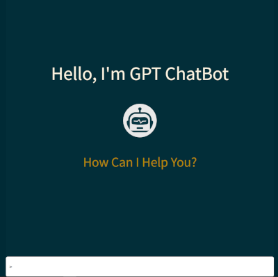

# DEMO Open AI Chatbot Web-UI

## Description

A very simple Demo Chat GPT frontend client built using Vite, React and TypeScript.

### NOTE: This is a demo project only. Never put Open AI API keys inside a production frontend client application. Instead create a backend API to contact Open AI and relay the response back to the client app using any required authorisation method

 

## Set-up

Clone the project and install all dependencies using npm install.

Create an Open API API key from your Open API account.

Copy the example.env file to .env in the project root and paste the API key value in.

From the command line run  

```
 npm run dev
```

This will start up up the VITE dev server and serve the app from localhost:5173

## TO DO

- Build a local dockerized Node.js backend service to contact Open AI and remove need for OpenAI API key in the App.
- Add functionality to save or print conversations or individual responses.
